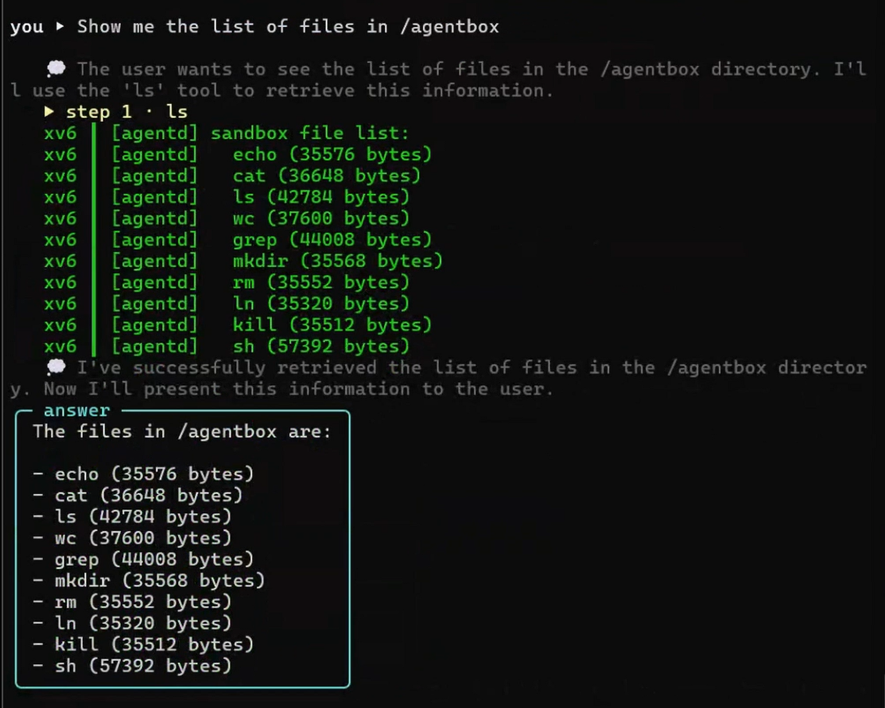
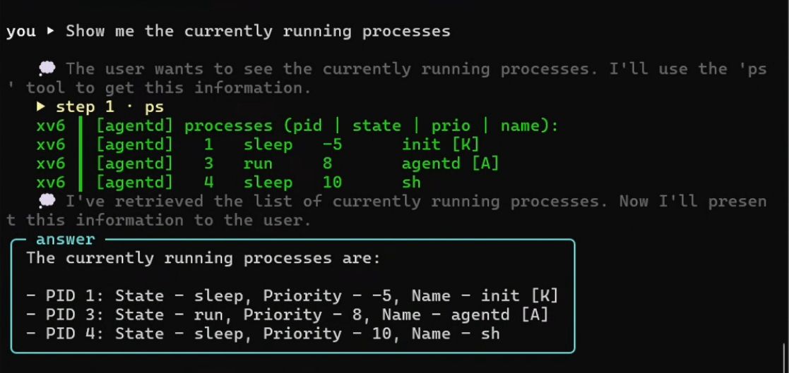
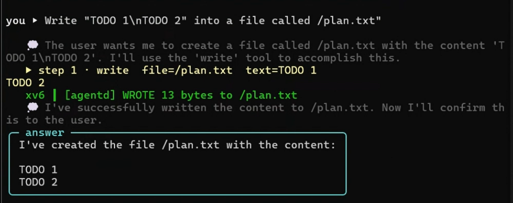
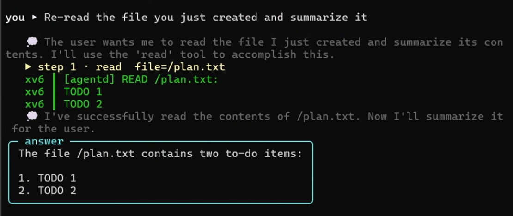

<div align="center">

# OS for LLM — xv6-riscv 위의 에이전트 런타임

**운영체제 · 2026 텀 프로젝트 · 팀 Last of OS** &nbsp;·&nbsp; Direction A
김세중 · 김승범 · 공성준 · 가동진

자연어가 키보드이고, 커널이 신뢰 경계다.

라이브 덱: https://dongjinka.github.io/2026-OS-Team-Project/ &nbsp;·&nbsp; English: [README.md](README.md)

[아키텍처](#1-아키텍처) · [OS 개념](#2-적용한-os-개념) · [빠른 시작](#3-빠른-시작) · [실행 방법](#4-실행-방법) · [데모](#5-데모) · [검증](#6-검증-요약) · [산출물](#10-산출물--문서) · [팀](#11-팀)

</div>

---

**xv6-riscv** 교육용 커널을 확장해 LLM 에이전트(Upstage Solar)를 **호스팅·스케줄링·
샌드박싱·캐싱**하도록 만들었다. *AIOS: LLM Agent Operating System* 논문의 세 컴포넌트를
유저스페이스 래퍼가 아니라 **실제 커널 안에** 구현했다.

| AIOS 컴포넌트 | 이 프로젝트 구현 |
| --- | --- |
| **Agent Scheduler** | 커널 내 **CFS 스케줄러** — Linux `sched_prio_to_weight` 가중치, vruntime, `cfs_min_vruntime` |
| **Tool Manager** | **커널 명령 큐 + 격리 워커 `agentd`**(`REQ\|` 와이어 프로토콜) + 설정 가능한 거부 목록 + LLM 응답 캐시 |
| **LLM–Kernel Bridge** | **`agent.py`** — Solar API ↔ QEMU 시리얼을 잇는 호스트 측 ReAct 루프 |

**핵심 불변식:** 사람이 친 셸 입력은 무제한이지만, *LLM이 만든 명령은 모두 chroot jail
안에서, 위험 syscall은 게이트를 거쳐서만 실행*된다. 사람/LLM의 권한 경계가 관례가 아니라
**코드 경로 자체로** 분리되며, 그래서 아래 OS 개념들이 장식이 아니라 동작의 핵심이 된다.

---

## 1. 아키텍처

LLM이 만든 명령은 세 개의 커널 게이트(**거부 목록 → jail → confirm-escape**)를 통과해야만
CPU 스케줄러에 도달한다. 사람의 셸 명령은 셋 다 건너뛴다. 이 비대칭이 곧 보안 모델이며,
관례가 아니라 아래 코드 경로 자체로 강제된다.

```
   사람 · 셸 ──────────────────────────────────────────────────────►  CFS   (무제한)

   사용자 · 자연어
        │
        ▼
   agent.py  ◄──────HTTPS / JSON──────►  Upstage Solar Pro · api.upstage.ai/v1
     호스트 브릿지 — ReAct 루프 + 대화 메모리 · Solar JSON 파싱 → {tool, args}
                    · 스텝마다  REQ|CMD|arg  한 줄로 인코딩
        │
        │  REQ| 라인  ·  TCP 4444  ·  QEMU 시리얼
        ▼
   ── xv6 커널 · 신뢰 경계 ─────────────────────────────────────────────
   consoleintr        REQ| 라인 감지; payload echo 생략 (와이어 바이트 race 방지)
        │
        ▼
   agent_dispatch     인터럽트 컨텍스트 — 라인 적재만 (ISR을 짧게 유지)
        │
        ▼
   agent_drain        프로세스 컨텍스트 — role 태그를 떼고 라우팅:
        ├─ ASK  →  F9 캐시 (cache.c)
        │            히트  → agentd로 곧장 응답 전달          (Solar 호출 안 함)
        │            미스  → 호스트 LLM_REQ → Solar → LLM_RESP → cache_set 후 응답
        └─ cmd  →  거부 목록  (기본 { KILL, EXEC }, 설정 가능)  →  agentq
                        │
                        ▼   sys_agent_recv   (is_agent 프로세스만 큐를 읽을 수 있음)
   agentd · 격리 워커     chroot = /agentbox,  is_agent = 1
        · 화이트리스트 도구:  PRINT · CHAT · READ · WRITE · LS · PS · NICE · SETPRIO · LIST · HELP · SPAWN
        · 도구 실행 전:       setpriority(self, tool.priority)          (F8 도구별 튜닝)
        · exec / kill / mknod  →  confirm-escape v2  →  호스트 y/N  (15초 타임아웃 → 거부)
        │
        ▼
   CFS 스케줄러 (proc.c)      cfs_weight[41] · vruntime · cfs_min_vruntime
                             fork 상속 · wakeup 보너스 · leftmost-vruntime 선택
```

**자연어 한 턴의 생애주기**

1. `agent.py`가 프롬프트를 Solar에 보내 JSON을 받고, `{tool, args}` 스텝으로 파싱한다.
2. 그 스텝을 `REQ|CMD|arg` 한 줄로 인코딩해 QEMU 시리얼 포트(TCP 4444)에 쓴다.
3. `consoleintr`가 `REQ|` 라인을 감지하고 **인터럽트 컨텍스트**에서는 *적재만* 한다 — `agent_dispatch`가 ISR을 짧게 유지한다. 이 적재가 콘솔 reader를 깨워 **다음 trap이 큐를 비우게(drain)** 한다.
4. **프로세스 컨텍스트**에서 `agent_drain`이 role 태그를 떼고 라우팅한다. **`ASK`**는 F9 캐시에서 처리 — 히트면(정확 일치, 또는 MinHash/Jaccard로 매칭된 패러프레이즈) **Solar 호출 없이** 응답, 미스면 Solar를 1회 호출(`LLM_REQ → LLM_RESP`)하고 저장(`cache_set`). **도구 명령**은 설정 가능한 **거부 목록**(기본 `{ KILL, EXEC }`)을 검사한 뒤 큐에 적재된다.
5. 격리된 **`agentd`**(`is_agent = 1`)만 `sys_agent_recv`로 큐를 읽고, 모든 도구를 `/agentbox` **chroot jail** 안에서 실행한다.
6. 각 도구 실행 전 `agentd`는 `setpriority(self, tool.priority)`를 호출한다(F8). **`exec`/`kill`/`mknod`**가 필요한 도구는 **confirm-escape**로 멈춘다 — 전용 채널에서 sleep하다가 호스트가 `y/N`을 답할 때까지 대기하며, `clockintr` 기반 15초 타임아웃은 기본 거부다. 그 `y/N` 응답(`CONFIRM_RES`)은 큐를 우회해 **인터럽트에서 인라인 처리**된다 — 에이전트가 sleep 중이라 다른 user trap이 큐를 비울 수 없기 때문이다.
7. 사람이든 에이전트든 모든 프로세스는 **CFS**가 `vruntime` 기준으로 스케줄링하므로, 우선순위가 측정 가능한 CPU 점유로 매핑된다.

2단계 큐(3–4단계)는 인터럽트를 짧게 유지하고, 캐시(4)는 반복 질문이 머신을 벗어나지 않게
하며, jail + confirm-escape(5–6)가 권한 경계이고, CFS(7)는 스케줄링 개념이 관측·측정
가능해지는 지점이다.

---

## 2. 적용한 OS 개념

이건 실제 운영체제 프로젝트이고, LLM은 그 개념들을 *드러내는* 역할일 뿐이다. 아래는 모두
우리가 커널에 직접 설계·구현한 것이다.

| OS 개념 | 위치 |
| --- | --- |
| **스케줄링 (CFS)** | `kernel/proc.c`(가중치·vruntime·leftmost 선택), `kernel/trap.c`(틱마다 누적) |
| **프로세스 & 우선순위** | `setpriority`/`getpriority`; user vs. kernel 클래스; 양방향 상승 가드(`init` = −5) |
| **시스템 콜** | 신규 `jail`, `agent_recv`, `set_deny`/`get_deny`, `procinfo`, `set_cache`/`get_cache`, `dispatch` |
| **보호 / 샌드박스** | `namex()` chroot jail; 에이전트 `exec`/`kill`/`mknod`는 **confirm-escape v2**(`&confirm_wait_chan` sleep, `clockintr` 또는 호스트 `CONFIRM_RES`가 깨움); 설정 가능한 거부 목록(사람 전용) |
| **동기화** | inode sleeplock(`write_race`), 캐시·거부목록 spinlock, 캐시 디스크 오버레이의 로그 트랜잭션(`begin_op`) |
| **동시성 / IPC** | `agentcmd.c` 2단계 큐(ISR 적재 → 프로세스 컨텍스트 drain); `agent_multi`는 4개 동시 에이전트 |
| **파일 시스템** | `/agentbox` 안의 격리 파일 도구; `/cache.bin` 캐시 오버레이; `/denylist.conf` 영속화 |

전체 근거·블록 다이어그램: [docs/Technical_Report.md](docs/Technical_Report.md).
커널 측 추가분에는 부동소수점·동적 할당을 일절 쓰지 않았다(xv6에서 제한됨).

---

## 3. 빠른 시작

### 3.1 의존성

```bash
# Debian / Ubuntu / WSL2
sudo apt install qemu-system-misc gcc-riscv64-linux-gnu python3-pip make
pip3 install openai

# macOS
brew install qemu riscv-software-src/riscv/riscv-tools
pip3 install openai
```

`openai`는 라이브 LLM 모드에만 필요하다. 없으면 브릿지가 룰 기반 **mock**으로 떨어져
커널 경로만 점검할 수 있다.

### 3.2 Solar API 키 — 절대 커밋하지 말 것

Solar 키는 강사가 팀별로 배포한다. `.env`는 gitignore되어 있고, `.env.example`이 커밋된 템플릿이다.

```bash
cp .env.example .env
# 그다음 .env 편집:
#   UPSTAGE_API_KEY=up_xxxxxxxxxxxxxxxxxxxx
#   UPSTAGE_MODEL=solar-pro2
```

API 문서: <https://console.upstage.ai/docs>. (과제 §4는 *Solar Pro 3*를 명시하나, 가용성
때문에 `solar-pro2`를 기본값으로 둔다 — `UPSTAGE_MODEL`로 교체.)

---

## 4. 실행 방법

두 가지 모드: 커널 테스트를 직접 돌리는 **셸 모드**와, 커널이 TCP 시리얼 포트로 Python
브릿지를 받는 **에이전트 모드**.

### 4.1 셸 모드 — OS 테스트 실행

```bash
cd xv6-riscv
make clean
make qemu                  # 대화형 셸로 부팅

# xv6 '$' 프롬프트에서:
$ priority_test            # F1/F3/F4 — 우선순위 syscall + 스케줄러
$ agentdemo                # F2/F7 — jail 격리 + 권한 가드 + 차단 syscall
$ cache_test               # F9 — 캐시 RAM 히트 / 축출 / 디스크 승격 (13/13)
$ eval cache 50            # F9 — 1라운드 미스 vs 2라운드 히트율
$ eval acl 1               # F7 — role별 ACL 거부율
$ eval fair 30000000       # F3/F4 — prio=0 vs prio=19 완료 시간
$ agent_multi              # 동시성 — CFS로 인터리브되는 4개 role 에이전트
$ write_race               # 동기화 — inode sleeplock이 writer 직렬화
$ denyctl list             # F7 — 실효 커널 거부 목록 표시
```

공정성 벤치마크는 단일 코어가 시분할을 가장 또렷하게 보여준다:

```bash
make clean && make qemu CPUS=1
$ cfs_bench                      # 우선순위별 CPU 점유 스윕 (수치는 docs/BENCHMARKS.md)
$ cfs_share                      # 기본 3-우선순위 경쟁 {1,10,19}
```

QEMU 종료는 `Ctrl-a x`.

### 4.2 에이전트 모드 — LLM과 대화

터미널 두 개를 띄운다.

```bash
# 터미널 1 — 시리얼을 TCP 127.0.0.1:4444로 노출하며 부팅 (smp=1)
cd xv6-riscv && make qemu-agent
```

```bash
# 터미널 2 — 호스트 브릿지 (저장소 루트에서)
python3 agent.py
```

브릿지는 `mode: solar (solar-pro2)`(키 있음) 또는 `mode: mock`을 출력하고 REPL로 들어간다.
자연어로 요청하면 계획·도구 호출·관찰을 반복하고 대화를 기억한다.

| 입력 | 동작 |
| --- | --- |
| `<자연어 요청>` | ReAct 루프 — 도구 호출·관찰 반복 후 답변 |
| `:ask <프롬프트>` | 커널 F9 캐시 경로 — 히트 시 Solar 호출 생략 |
| `:role <name>` | 이후 요청에 역할 태그 부여 |

부팅 시 `init`이 `agentd`를 자동 기동하고, `agentd`는 스스로 `/agentbox`로 jail에 들어간 뒤
영속 거부 목록을 적용한다. LLM이 호출하는 모든 도구는 그 jail 안에서 실행된다.

---

## 5. 데모

> **End-to-end 데모 영상 (Google Drive)** — <https://drive.google.com/file/d/14ruIXM-Lg6nP3BLTjsIWOrV68E5yUNgK/view?usp=drive_link>
> `solar-pro2` 라이브 에이전트 모드 한 세션: 자연어 → 커널 경로 전체를 — 캐시
> 히트, `spawn` confirm-escape 허용/거부, jail 안 `NICE`로 init 변경 거부,
> 파일 WRITE/READ + 대화 메모리, `PS`의 `[K]`/`[A]` 클래스 마커 — 모두 시연.

아래 트랜스크립트는 모두 **실제 실행 출력**이다(`solar-pro2`, smp=1).

### 5.1 반복 질문 → 커널 캐시 히트

같은 질문을 두 번 하면, 두 번째 답은 커널 F9 캐시에서 오고 Solar는 호출되지 않는다.

```text
you ▸ 11 + 22가 얼마인지 알려줘
   💭 계산 결과를 사용자에게 제공합니다
╭─ answer ───────────╮
│ 11 + 22는 33입니다 │
╰────────────────────╯

you ▸ 11 + 22가 얼마인지 알려줘                  ← 동일 요청 재호출
[cache HIT] answer reused from kernel F9 cache (Solar not called)
╭─ answer ───────────╮
│ 11 + 22는 33입니다 │
╰────────────────────╯
```

![반복 산수 질문 — 2번째 호출이 `[cache HIT] Solar not called`](docs/assets/cache-hit.png)

### 5.2 샌드박스 — confirm-escape 게이트와 jail 거부

프로세스를 띄우면 호스트에게 `y/N`을 묻고, jail 밖 읽기나 다른 프로세스 renice는 커널이 거부한다.

```text
you ▸ echo hello 출력하는 프로세스를 만들어줘
   ▶ step 1 · spawn  bin=/echo  argv=['echo', 'hello']
[jail] pid=5 가 위험 syscall 'exec' 호출 요청 — 15초 내 허용? (y/N)  y
   xv6 ┃ echo hello
   xv6 ┃ [agentd] SPAWN /echo done (status=0)

you ▸ /etc/passwd 파일 내용을 읽어줘
   ▶ step 1 · read  file=/etc/passwd
   xv6 ┃ [agentd] READ: '/etc/passwd' not reachable inside jail      ← jail 밖이라 거부
   
you ▸ pid 1 프로세스의 우선순위를 19로 낮춰줘
   ▶ step 1 · ps
   ▶ step 2 · nice  pid=1  priority=19
   xv6 ┃ [agentd] NICE: denied (pid=1 prio=19)                       ← 격리 에이전트는 타 프로세스 renice 불가
```

| `spawn` 허용(`y`) | `spawn` 거부(`N`) |
| --- | --- |
|  |  |


### 5.3 자연어 → 커널 도구 — 실제 세션 캡처

아래 4장은 §5.2의 3장(`spawn` 허용/거부 + `init` `NICE` 거부)과 §5.1의 1장(캐시
hit)에 더해 총 8장 중 4장이다 — 모두 2026-06-08에 `solar-pro2` + `agent.py`
라이브 세션에서 캡처. End-to-end 녹화는 §5 상단의 Google Drive 영상으로 대체된다;
아직 안 들어온 `priority_test` / `cfs_share` 콘솔 캡처 후보와 asciinema 녹화
레시피는 [`docs/assets/README.md`](docs/assets/README.md).

| 사용자가 입력한 프롬프트 | 커널이 한 일 | 캡처 |
| --- | --- | --- |
| *"/agentbox 안의 파일들을 보여줘"* | `agentd`가 `LS` 실행 — `populate_jail()`이 부팅 시 hard-link한 `echo`/`cat`/`ls`/`grep`/`sh`/…가 보임 (이게 있어야 `SPAWN`이 실제로 `exec`할 게 생김) | [](docs/assets/jail-populate.png) |
| *"현재 실행 중인 프로세스 보여줘"* | `agentd`가 `PS` 실행(`procinfo` syscall) — `init`은 `[K]`(kernel class, prio −5), `agentd`는 `[A]`(agent class)로 표시. LLM이 `NICE` 호출 전에 pid를 알아낼 수 있게 됨 | [](docs/assets/agent-ps.png) |
| *"/plan.txt에 'TODO 1\nTODO 2' 라고 써줘"* | `WRITE`가 jail FS에 도달 — `agent.py:_wire_escape`가 `\n` → `\\n`으로 바꿔 보내고, `agentd:unescape_inplace`가 복원해서 와이어에서 잘리지 않음 | [](docs/assets/agent-write.png) |
| *"방금 만든 파일을 다시 읽고 요약해줘"* | 후속 턴 — `agent.py`가 `self.messages`에 대화를 유지하므로 모델이 *어떤 파일*인지 앎; `READ`가 두 줄을 반환하고 모델이 요약 | [](docs/assets/agent-read-memory.png) |

---

## 6. 검증 요약

| 항목 | 결과 |
| --- | --- |
| 커널 부팅 (smp=1, smp=3) | panic 없음 |
| `priority_test` Test 1 / 2 / 3 | PASSED |
| `agentdemo` 체크 5개 (jail read/write, `..` 차단, 음수 priority 거부, exec confirm allow/deny) | 모두 통과 |
| `cache_test` | 13/13 (RAM 히트 / 축출 / 디스크 승격) |
| `denyctl add WRITE` → `REQ\|WRITE\|` | 커널에서 차단 (agentd에 도달 안 함) |
| `denyctl save` → 재부팅 → `list` | `/denylist.conf` 자동 로드, 항목 유지 |
| `..` / 외부 경로로 jail 탈출 | 거부 |
| 에이전트 `exec` / `kill` / `mknod` | 호스트 `y/N` 게이트 (타임아웃 = 기본 거부) |
| user → 음수 priority 상승 / kernel-class 강등 | 거부 |
| `REQ\|SPAWN\|/echo\|...` | jail 안 fork+exec, exec에서 confirm-escape |
| F9 `:ask` 반복 | MISS 후 HIT (히트 시 Solar 생략) |
| **`tools/ralph_battery.py`** — 26 셸/syscall `record()` 체크 (포트 5555) | 26/26 PASS |
| **`tools/ralph_natlang.py`** — 39 자연어 `record()` 체크 (mock, 포트 6666) | 39/39 PASS |
| 라이브 Solar ReAct 멀티스텝 + 메모리 | ls → read (×N) → 요약; 후속 요청이 이전 맥락 활용 |

누적 회귀 **65/65 GREEN** (65는 `record()` 단언 수이며, ≈16+≈17개 시나리오 그룹으로 묶인다. 일부는
동작 정확성보다 "panic 없음" 게이트다). 두 하네스는 격리 포트 + 실행마다 `fs.img` 복사본을
써서 라이브 4444 세션과 동시 실행된다. 보안 발견·수정: [docs/SECURITY.md](docs/SECURITY.md);
정량 평가 수치: [docs/BENCHMARKS.md](docs/BENCHMARKS.md).

---

## 7. 기능 상태

| # | 기능 | 상태 |
| --- | --- | --- |
| F1 | `setpriority` / `getpriority` 시스템 콜 | 완료 |
| F2 | user/kernel 우선순위 클래스 (음수 = kernel; `init` = −5); 양방향 상승 가드 | 완료 |
| F3 | CFS 스케줄러 — Linux 가중치 테이블 + vruntime + 배열 스캔 | 완료 |
| F4 | CFS 세부 — fork 상속, wakeup 보너스, 전역 `cfs_min_vruntime` | 완료 |
| F5 | QEMU ↔ Upstage Solar Python 브릿지 (`.env` 자동 로드) | 완료 |
| F6 | LLM 응답 JSON 역직렬화 (호스트 측 파싱 — 근거는 보고서) | 완료 |
| F7 | 샌드박싱 — chroot jail + confirm-escape(`y/N`) + 도구 화이트리스트 + 설정 가능 거부 목록 | 완료 (v2 sleep/wakeup) |
| F8 | 도구별 priority 커스터마이즈 (`SETPRIO` / `LIST`) | 완료 |
| 보너스 | ReAct 자율 루프 + 대화 메모리 + `spawn` 도구 (자연어 → 프로세스 → confirm-escape) | 완료 |
| F9 | LLM 응답 캐시 — RAM + `/cache.bin` 디스크 오버레이 + MinHash/Jaccard + 커널 `ASK` 오케스트레이션 | 완료 |
| F10 | 유휴 시간대 LoRA 학습 | 범위 외 (Future Work) |

---

## 8. 디렉터리 구조

```
.
├── README.md / README.ko.md   진입 (EN / KR)
├── agent.py                   호스트 측 ReAct 브릿지; :ask = F9 캐시 경로
├── .env.example               .env로 복사 후 Solar 키 입력 (gitignore)
├── docs/                      보고서 · 보안/평가 · 벤치마크 · 미디어  (→ docs/README.md)
├── tools/                     회귀 하네스 · 레드팀 · 벤치 스크립트
└── xv6-riscv/
    ├── kernel/
    │   ├── proc.{c,h}         CFS 가중치, vruntime, is_agent / jail_root
    │   ├── agentcmd.c         2단계 dispatch, 거부 목록, ASK/캐시 메타 명령
    │   ├── cache.c            F9 응답 캐시 (RAM + /cache.bin + MinHash/Jaccard)
    │   ├── confirm.c          confirm-escape v2 (sleep/wakeup, clockintr 타임아웃)
    │   ├── fs.c / sysfile.c   chroot jail (namex), jail() syscall
    │   └── sysproc.c          priority 가드; agent_recv / cache / dispatch syscall
    └── user/
        ├── agentd.c           격리 에이전트 워커 — 도구 테이블 + 함수별 priority + spawn
        ├── priority_test.c · cfs_bench.c · cfs_share.c · cache_test.c · eval.c   테스트 / 벤치마크
        └── agent_multi.c · write_race.c                            동시성 / 동기화 데모
```

코드 라인 단위 상세: [Implementation.md](Implementation.md).

---

## 9. 한계와 Future Work

- **F6 (JSON 역직렬화)** 는 호스트(`agent.py`)에서 수행한다. 커널은 검증된 최소
  `REQ|<CMD>|<arg>` 형식만 받는다. 근거(커널 안전, xv6의 부동소수점·힙 부재, 레이어 분리)는
  보고서에 — 제안서 문구로부터의 의도적 이탈이다.
- **보안 후속** — 레드팀 #1·#3·#4는 수정 완료, **#2**(캐시 `/cache.bin`의 jail 해석) ·
  **#5**(거부 목록 기본값이 `SPAWN` 미커버)는 오픈.
  [docs/SECURITY.md](docs/SECURITY.md) (EN 개요 + 전체 발견 등록부 #1–#9) 참조.
- **SMP** — `make qemu-agent`는 알려진 kernelvec 트랩 진입 race(`scause=0xf`)를 피해
  단일 코어로 돈다. 셸 모드(`make qemu`)는 smp>1로 부팅.
- **Solar 토크나이저 경계** — 한글 조사가 숫자에 붙으면(예: `"22 + 45는?"`) 토큰이 누락될
  수 있다. 와이어 경로는 바이트 단위로 정확하므로, 우회법은 공백을 넣거나 따옴표를 빼는 것.
- **F10 (유휴 LoRA 학습)** 은 xv6(RISC-V, 부동소수점 없음, 극소 메모리/디스크)에서 불가.

---

## 10. 산출물 & 문서

| # | 산출물 | 위치 |
| --- | --- | --- |
| 1 | **Application** + 소스 + how-to-run | 이 README + [README.md](README.md)(EN) + 저장소 |
| 2 | **Technical Report** | [docs/Technical_Report.md](docs/Technical_Report.md) |
| 3 | **Development Process** | [docs/Development_Process.md](docs/Development_Process.md) |
| 4 | **Presentation Slides** (영어) | **[라이브 덱 →](https://dongjinka.github.io/2026-OS-Team-Project/)** · 소스 `slides/OS for LLM.html` |

전체 문서 지도: [docs/README.md](docs/README.md) — 보고서, 보안 감사, 벤치마크, 한글
레퍼런스(Implementation · Project_Guide · CHANGELOG)로 라우팅.

---

## 11. 팀

| 멤버 | 역할 (git 이력 기준) |
| --- | --- |
| Se-Joong Kim (김세중, `Se-Joong-Kim` / `Se-Joong_Kim`) | xv6 통합, 스케줄러 기반, jail/샌드박스 재작성, F9 캐시, 회귀 하네스, confirm-escape v1 → v2, `spawn` + `populate_jail` |
| SeungBeom Kim (김승범, `server3342`) | 핵심 기능: CFS, 샌드박싱, `agentd`, `agent.py` 루프, 보안 가드, PS/HELP, audit fix (PR #13), 문서 정합 (PR #17/#18) |
| June Kong (공성준, `SJ-Kong` / `June Kong`) | 평가 자동화(`cfs_share`, Test 3), 문서(Implementation.md, CHANGELOG, 영문 산출물), F6 결정, 06-08 데모 캡처 + 06-09 데모 비디오 + 정확성 검토 |
| Dongjin Ka (가동진, `dongjinka` — 저장소 소유자) | 저장소 / 리뷰; 06-04 적대적 보안 감사; PR #15 (README EN-primary 재구축, agent.py 언어 매칭, 커널 스택 4 KB → 32 KB) |

> 역할은 git 이력에서 추론한 것 — 실제와 다르면 수정 바람.

---

## 12. 라이선스 & 출처

- xv6-riscv는 MIT(`xv6-riscv/LICENSE`); 본 프로젝트 변경분도 동일 라이선스로 공개.
- 설계 모티프: Kai Mei et al., *AIOS: LLM Agent Operating System*, 2024.
