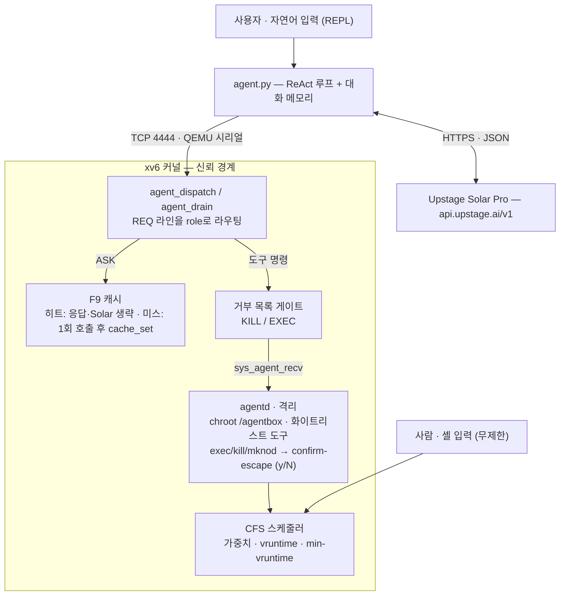

<div align="center">

# OS for LLM

**xv6-riscv 위에서 LLM을 호스팅·스케줄링·샌드박싱하는 자율 에이전트 런타임**

[](#검증)
[](#라이선스)
[](xv6-riscv/)
[](#기술-스택)
[](https://console.upstage.ai/docs)

[데모](#데모) · [빠른 시작](#빠른-시작) · [아키텍처](#아키텍처) · [기술 보고서](docs/Technical_Report.md) · [보안 감사](docs/SECURITY_AND_EVALUATION.md) · [문서 전체](docs/README.md) · [English](README.md)

</div>

<p align="center">
  <a href="docs/assets/demo-cache.svg">
    
  </a>
  <br><sub>실제 실행 출력을 옮긴 SVG — 녹화본으로 교체하려면 <a href="docs/assets/README.md">docs/assets/README.md</a></sub>
</p>

> 2026 운영체제 팀 프로젝트 · **Direction A — OS for LLM.** xv6-riscv 커널 위에 Upstage
> Solar(LLM)를 호스팅·지휘하는 에이전트 런타임을 구현했다. AIOS 논문의 세 컴포넌트
> (Agent Scheduler / Tool Manager / LLM Kernel Bridge)를 커널·사용자 프로그램·호스트
> 브릿지에 직접 이식해, **사람의 셸 입력은 그대로 두면서 LLM이 생성한 명령만 샌드박스
> 안에서 실행**한다. 스케줄러·우선순위 시스템콜·chroot jail·격리 워커·ReAct 루프가
> 한 줄로 연결된다.

- **Agent Scheduler** — Linux `sched_prio_to_weight`를 이식한 **CFS 스케줄러**(vruntime, 41단계 가중치)가 사람·에이전트 프로세스를 우선순위대로 공평하게 배분한다.
- **Tool Manager** — 격리 워커 **`agentd`**(chroot jail + 화이트리스트 도구)가 LLM의 명령을 받고, `exec`/`kill`/`mknod`는 **confirm-escape**로 호스트에게 `y/N`을 묻는다.
- **LLM Kernel Bridge** — **`agent.py`**가 Solar API와 QEMU 시리얼을 잇는 ReAct 루프를 돌리고, 반복 지식 질의는 **커널 F9 캐시**로 받아 Solar 호출을 생략한다.

<details>
<summary><b>AIOS 논문 컴포넌트 → 구현 매핑</b></summary>

| AIOS 컴포넌트 | 이 프로젝트 구현 |
| --- | --- |
| Agent Scheduler | **CFS 스케줄러** — Linux 가중치 테이블 이식, vruntime, `cfs_min_vruntime` |
| Tool Manager | **agentd** + 커널 명령 큐(`REQ\|CMD\|arg`) + 화이트리스트 + confirm-escape |
| LLM Kernel Bridge | **agent.py** — Solar API ↔ QEMU TCP 시리얼, ReAct 루프, F9 캐시 경로 |

</details>

---

## 데모

아래 데모는 모두 **실제 실행 출력**을 옮긴 것이다(solar-pro2, smp=1).

### 1. 자연어 요청 → 캐시 히트

동일한 질문을 두 번째로 보내면 커널 F9 캐시가 응답을 돌려주고 Solar API를 호출하지 않는다.

```text
you ▸ 11 + 22가 얼마인지 알려줘
   💭 계산 결과를 사용자에게 제공합니다
╭─ answer ───────────╮
│ 11 + 22는 33입니다 │
╰────────────────────╯

you ▸ 11 + 22가 얼마인지 알려줘          ← 동일 요청 재호출
[cache HIT] answer reused from kernel F9 cache (Solar not called)
╭─ answer ───────────╮
│ 11 + 22는 33입니다 │
╰────────────────────╯
```

### 2. 샌드박스 — confirm-escape & jail 차단

LLM이 프로세스를 띄우려 하면(`exec`) 호스트에게 `y/N`을 묻고, jail 밖 파일 읽기나
다른 프로세스 renice는 커널이 거부한다.

<p align="center">
  
</p>

```text
you ▸ echo hello 출력하는 프로세스를 만들어줘
   ▶ step 1 · spawn  bin=/echo  argv=['echo', 'hello']
[jail] pid=5 가 위험 syscall 'exec' 호출 요청 — 15초 내 허용? (y/N)  y
   xv6 ┃ echo hello
   xv6 ┃ [agentd] SPAWN /echo done (status=0)

you ▸ /etc/passwd 파일 내용을 읽어줘
   ▶ step 1 · read  file=/etc/passwd
   xv6 ┃ [agentd] READ: '/etc/passwd' not reachable inside jail      ← jail 밖 거부

you ▸ pid 1 프로세스의 우선순위를 19로 낮춰줘
   ▶ step 1 · ps
   ▶ step 2 · nice  pid=1  priority=19
   xv6 ┃ [agentd] NICE: denied (pid=1 prio=19)                       ← 격리 에이전트의 타 프로세스 renice 거부
```

### 3. CFS 우선순위 → CPU 점유

여섯 프로세스가 서로 다른 우선순위로 같은 시간 경쟁하면, 실제 CPU 점유가 Linux 가중치
비율과 단조적으로 일치한다(세부: [BENCHMARKS](docs/BENCHMARKS.md)).

| priority | weight | 측정 점유 | 기대 점유 |
| ---: | ---: | ---: | ---: |
| 0 | 1024 | 56.9% | 59.1% |
| 4 | 423 | 23.9% | 24.4% |
| 8 | 172 | 9.7% | 9.9% |
| 12 | 70 | 5.2% | 4.0% |
| 16 | 29 | 2.5% | 1.7% |
| 19 | 15 | 1.9% | 0.9% |

---

## 빠른 시작

### 의존성 (Ubuntu / WSL2)

```bash
sudo apt install qemu-system-misc gcc-riscv64-linux-gnu python3-pip make
pip install openai
```

### Solar API 키

```bash
cp .env.example .env
# .env 를 열어 UPSTAGE_API_KEY=up_xxxxxxxx 를 채운다
```

- 키는 [console.upstage.ai/docs](https://console.upstage.ai/docs)에서 발급한다(팀 배포 키 사용).
- **`.env` 는 절대 커밋하지 않는다** — `.gitignore`로 차단되어 있다. `agent.py`가 스크립트 옆 `.env`를 자동 로드한다.
- 키가 없으면 `agent.py`는 **mock 모드**(룰 기반 더미)로 돌아 커널 경로만 점검할 수 있다.

### 빌드 & 실행 (에이전트 모드)

터미널 두 개를 띄운다.

```bash
# 터미널 1 — xv6 부팅 (TCP 4444로 시리얼 노출, smp=1)
cd xv6-riscv && make qemu-agent
```

```bash
# 터미널 2 — 에이전트 브릿지
python3 agent.py
```

기동 시 `[agent] mode = solar (solar-pro2)` 또는 `mode = mock`으로 모드를 알린다. `you ▸`
프롬프트에 자연어로 요청하면 ReAct 루프가 계획·도구 호출·관찰을 반복한다.

| 입력 | 동작 |
| --- | --- |
| `<자연어 요청>` | ReAct 루프 — 도구 호출·관찰 반복 후 답변 |
| `:ask <프롬프트>` | 커널 F9 캐시 경로 — 히트 시 Solar 호출 생략 |
| `:role <name>` | 이후 요청에 역할 태그 부여 |

종료는 `Ctrl-D`. xv6 측은 `make qemu-agent` 터미널에서 `Ctrl-A X`.

### 셸 단독 모드 (CFS / 샌드박스 데모)

```bash
cd xv6-riscv && make qemu
```

```text
$ priority_test     # F1·F3·F4 우선순위/CFS 검증 (Test 1·2·3 PASSED)
$ agentdemo         # F2·F7 샌드박스 데모 (jail 진입 후 차단 시나리오)
$ cfs_bench         # 우선순위별 CPU 점유 측정 (위 벤치마크 표의 원천)
```

---

## 아키텍처

사람의 셸 입력은 무제한이지만, **LLM이 만든 명령은 커널 게이트(거부 목록 · confirm-escape ·
chroot jail)를 통과해야만 실행**된다. 권한 경계가 코드 경로 자체로 분리된다.



<details>
<summary><b>디렉터리 구조</b></summary>

```
.
├── README.md / README.ko.md     # 진입 (EN / KR)
├── CHANGELOG.md                 # 변경 이력
├── agent.py                     # 호스트 측 LLM 에이전트 루프
├── .env.example                 # API 키 템플릿 (.env 는 .gitignore)
├── docs/                        # 보고서 · 보안/평가 · 벤치마크 (→ docs/README.md)
├── tools/                       # 회귀 하네스 · 레드팀 · 벤치 스크립트
└── xv6-riscv/
    ├── Makefile                 # qemu / qemu-agent 타깃
    ├── kernel/                  # proc(CFS·우선순위) · agentcmd · cache · confirm · fs(jail)
    ├── user/                    # agentd · agentdemo · priority_test · cfs_bench
    └── mkfs/                    # 디스크 이미지 빌더
```

모듈·파일·라인 단위 상세는 [`Implementation.md`](Implementation.md) 참조.

</details>

---

## 기술 스택

- **커널**: xv6-riscv (C, RISC-V 64), QEMU 7.2+
- **호스트 브릿지**: Python 3 + [`openai`](https://pypi.org/project/openai/) SDK (Solar는 OpenAI 호환)
- **LLM**: Upstage Solar (`UPSTAGE_MODEL=solar-pro2`, `.env`로 교체 가능). 과제 §4는 Solar Pro 3를 명시하나, 가용성 문제로 solar-pro2를 기본값으로 사용한다.
- **호스트–게스트 통신**: QEMU `-serial tcp:127.0.0.1:4444,server,nowait`

---

## 핵심 기능

| # | 기능 | 상태 |
| --- | --- | --- |
| F1 | `setpriority` / `getpriority` 시스템 콜 | 완료 |
| F2 | user/kernel 우선순위 클래스 (음수 priority = kernel-class) | 완료 |
| F3 | CFS 본체 — Linux 가중치 테이블 + vruntime + min-vruntime 스캔 | 완료 |
| F4 | CFS 세부 — fork 상속, wakeup 보너스, 전역 `cfs_min_vruntime` | 완료 |
| F5 | QEMU ↔ Upstage Solar Python 브릿지 (`.env` 자동 로드) | 완료 |
| F6 | LLM 응답 JSON 역직렬화 (호스트 측 파싱) | 완료 |
| F7 | 샌드박싱 — chroot jail + confirm-escape(`y/N`) + 명령 화이트리스트 | 완료 (v2 sleep/wakeup) |
| F8 | 도구별 priority 커스터마이즈 (`SETPRIO` / `LIST`) | 완료 |
| 보너스 | ReAct 자율 루프 + 대화 메모리 + `spawn` 도구(자연어 → 프로세스 생성) | 완료 |
| F9 | LLM 응답 캐시 (16-슬롯 RAM + `/cache.bin` + MinHash/Jaccard) | 완료 |
| F10 | 유휴 시간대 LoRA 학습 | 범위 외 (Future Work) |

---

## 검증

| 검증 항목 | 결과 |
| --- | --- |
| 커널·`fs.img` 빌드, smp=1·smp=3 QEMU 부팅 | panic 없음 |
| `priority_test` Test 1/2/3 | 모두 PASSED |
| `agentdemo` 체크 5개 (jail read/write, `..` 차단, 음수 priority 거부, exec confirm allow/deny) | 모두 통과 |
| 와이어 명령 (`PRINT` · `NICE` · `SPAWN` · unknown) | 기대 동작 |
| 실제 Solar 멀티스텝 시나리오 (write → ls → read×N → 요약 → 대화 메모리) | 통과 |
| **`tools/ralph_battery.py`** — 26 셸/syscall 자동 회귀 (포트 5555) | 26/26 PASS |
| **`tools/ralph_natlang.py`** — 39 자연어 자동 회귀 (mock, 포트 6666) | 39/39 PASS |

**자동 회귀 총 65/65 GREEN.** (65는 `record()` 단언 항목 수 — 16개 시나리오 S0–S15와
17개 N1–N17에 걸쳐 있으며, 일부 항목은 동작 정확성보다 "panic 없음" 게이트다.) 두 회귀는
격리 포트 + 자체 `fs.img` 복사본을 써서 4444 사용자 세션과 동시 실행할 수 있다. 세부 지표·진단 history는
[Project_Guide.md §11](Project_Guide.md), 보안·평가 정량 결과는
[SECURITY_AND_EVALUATION.md](docs/SECURITY_AND_EVALUATION.md) 참조.

---

## 최종 산출물

| # | 산출물 | 위치 |
| --- | --- | --- |
| 1 | Application + 소스 + how-to-run | [README.md](README.md) (EN) + 이 문서(KR) + 저장소 |
| 2 | Technical Report (EN) | [docs/Technical_Report.md](docs/Technical_Report.md) |
| 3 | Development Process (EN) | [docs/Development_Process.md](docs/Development_Process.md) |
| 4 | Presentation Slides (EN) | `slides/` *(추가 예정)* |

문서 전체 지도는 [`docs/README.md`](docs/README.md)에 있다 — 보고서, 보안 감사,
벤치마크, 한글 레퍼런스(Implementation · Project_Guide · CHANGELOG)로 라우팅한다.

---

## 한계와 Future Work

- **F6 JSON 파싱 위치** — 현재 호스트(`agent.py`)에서 파싱한다. 제안서 원문은
  "xv6 내부 구현"을 명시하므로 보고서에 설계 근거를 밝히거나 `kernel/json.c` 미니
  파서로 이식하는 옵션이 남아 있다.
- **F10 유휴 LoRA 학습** — xv6(RISC-V, FP·디스크·메모리 극히 제한)에서 실제 학습은
  불가. Future Work로 분류.
- **보안 후속** — 레드팀 감사 #1·#3·#4는 수정 완료, **#2**(캐시 jail-root) · **#5**
  (deny-list SPAWN)는 오픈. 요약 [SECURITY_AND_EVALUATION.md](docs/SECURITY_AND_EVALUATION.md),
  전체 감사 [SECURITY_AUDIT.md](docs/SECURITY_AUDIT.md).
- **SMP** — `make qemu-agent`는 알려진 kernelvec 트랩 진입 race(`scause=0xf`)를 피해
  단일 코어로 돈다. 셸 모드(`make qemu`)는 smp>1로 부팅된다.

---

## 참조 / 인용

설계 모티프는 AIOS:

```bibtex
@article{mei2024aios,
  title  = {AIOS: LLM Agent Operating System},
  author = {Mei, Kai and others},
  year   = {2024}
}
```

- [Project_Guide.md](Project_Guide.md) — 종합 가이드(기초 개념 · 회귀/디버깅 history · 자연어 사용 가이드)
- [Implementation.md](Implementation.md) — 모듈별 구현 상세, 와이어 프로토콜
- [Project_requirements.md](Project_requirements.md) — 과제 요구사항 원문

---

## 라이선스

- xv6-riscv 원본은 MIT ([xv6-riscv/LICENSE](xv6-riscv/LICENSE)).
- 본 프로젝트의 자체 변경분도 동일하게 MIT로 공개.
</content>
