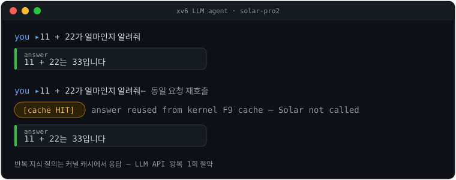
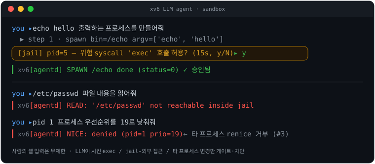
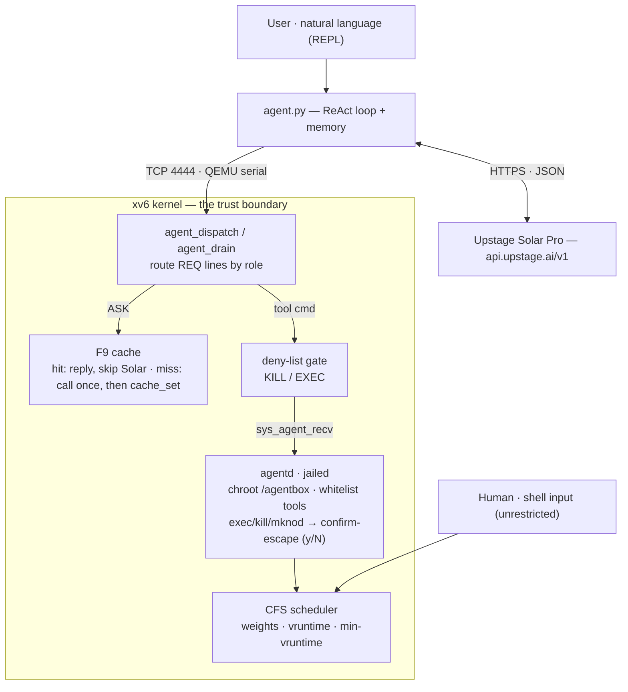

<div align="center">

# OS for LLM

**An autonomous agent runtime that hosts, schedules, and sandboxes an LLM on xv6-riscv**

[](#verification)
[](#license)
[](xv6-riscv/)
[](#tech-stack)
[](https://console.upstage.ai/docs)

[Demo](#demo) · [Quick Start](#quick-start) · [Architecture](#architecture) · [Technical Report](docs/Technical_Report.md) · [Security](docs/SECURITY_AND_EVALUATION.md) · [Docs](docs/README.md) · [한국어](README.ko.md)

</div>

<p align="center">
  <a href="docs/assets/demo-cache.svg">
    
  </a>
  <br><sub>SVG transcribed from real run output — to replace with a recording see <a href="docs/assets/README.md">docs/assets/README.md</a></sub>
</p>

> 2026 Operating Systems team project · **Direction A — OS for LLM.** We host and
> orchestrate Upstage Solar (an LLM) on top of the xv6-riscv kernel. The three
> components of the AIOS paper (Agent Scheduler / Tool Manager / LLM Kernel
> Bridge) are ported directly into the kernel, the user programs, and a host
> bridge, so that **a human's shell input runs unrestricted while every command
> the LLM emits executes only inside a sandbox.** Scheduler, priority syscalls, a
> chroot jail, an isolated worker, and a ReAct loop are wired end to end.

- **Agent Scheduler** — a **CFS scheduler** that ports Linux's `sched_prio_to_weight` (vruntime, 41 weight steps) divides CPU fairly between human and agent processes by priority.
- **Tool Manager** — an isolated worker **`agentd`** (chroot jail + whitelisted tools) receives the LLM's commands; `exec`/`kill`/`mknod` trigger a **confirm-escape** that asks the host `y/N`.
- **LLM Kernel Bridge** — **`agent.py`** runs a ReAct loop linking the Solar API to the QEMU serial port; repeated knowledge queries are served from the **kernel F9 cache**, skipping the Solar call.

<details>
<summary><b>AIOS paper component → implementation mapping</b></summary>

| AIOS component | This project |
| --- | --- |
| Agent Scheduler | **CFS scheduler** — ported Linux weight table, vruntime, `cfs_min_vruntime` |
| Tool Manager | **agentd** + kernel command queue (`REQ\|CMD\|arg`) + whitelist + confirm-escape |
| LLM Kernel Bridge | **agent.py** — Solar API ↔ QEMU TCP serial, ReAct loop, F9 cache path |

</details>

---

## Demo

Every transcript below is **real run output** (solar-pro2, smp=1).

### 1. Natural-language request → cache hit

Send the same question a second time and the kernel F9 cache returns the answer without calling the Solar API.

```text
you ▸ 11 + 22가 얼마인지 알려줘                  (“what is 11 + 22?”)
   💭 계산 결과를 사용자에게 제공합니다
╭─ answer ───────────╮
│ 11 + 22는 33입니다 │
╰────────────────────╯

you ▸ 11 + 22가 얼마인지 알려줘                  ← same request again
[cache HIT] answer reused from kernel F9 cache (Solar not called)
╭─ answer ───────────╮
│ 11 + 22는 33입니다 │
╰────────────────────╯
```

### 2. Sandbox — confirm-escape & jail denial

When the LLM tries to spawn a process (`exec`) the host is asked `y/N`; reading a
file outside the jail, or renicing another process, is denied by the kernel.

<p align="center">
  
</p>

```text
you ▸ echo hello 출력하는 프로세스를 만들어줘       (“spawn a process that prints echo hello”)
   ▶ step 1 · spawn  bin=/echo  argv=['echo', 'hello']
[jail] pid=5 가 위험 syscall 'exec' 호출 요청 — 15초 내 허용? (y/N)  y
   xv6 ┃ echo hello
   xv6 ┃ [agentd] SPAWN /echo done (status=0)

you ▸ /etc/passwd 파일 내용을 읽어줘                (“read /etc/passwd”)
   ▶ step 1 · read  file=/etc/passwd
   xv6 ┃ [agentd] READ: '/etc/passwd' not reachable inside jail      ← denied outside jail

you ▸ pid 1 프로세스의 우선순위를 19로 낮춰줘        (“renice pid 1 to 19”)
   ▶ step 1 · ps
   ▶ step 2 · nice  pid=1  priority=19
   xv6 ┃ [agentd] NICE: denied (pid=1 prio=19)                       ← a jailed agent cannot renice others
```

### 3. CFS priority → CPU share

Six processes at different priorities compete for the same wall-clock window;
measured CPU share tracks the Linux weight ratio monotonically (detail:
[BENCHMARKS](docs/BENCHMARKS.md)).

| priority | weight | measured share | expected share |
| ---: | ---: | ---: | ---: |
| 0 | 1024 | 56.9% | 59.1% |
| 4 | 423 | 23.9% | 24.4% |
| 8 | 172 | 9.7% | 9.9% |
| 12 | 70 | 5.2% | 4.0% |
| 16 | 29 | 2.5% | 1.7% |
| 19 | 15 | 1.9% | 0.9% |

---

## Quick Start

### Dependencies (Ubuntu / WSL2)

```bash
sudo apt install qemu-system-misc gcc-riscv64-linux-gnu python3-pip make
pip install openai
```

### Solar API key

```bash
cp .env.example .env
# open .env and fill in UPSTAGE_API_KEY=up_xxxxxxxx
```

- Issue a key at [console.upstage.ai/docs](https://console.upstage.ai/docs) (use the team-issued key).
- **Never commit `.env`** — it is blocked by `.gitignore`. `agent.py` auto-loads the `.env` next to the script.
- With no key, `agent.py` runs in **mock mode** (rule-based dummy) so the kernel path can still be exercised.

### Build & run (agent mode)

Open two terminals.

```bash
# Terminal 1 — boot xv6 (serial exposed on TCP 4444, smp=1)
cd xv6-riscv && make qemu-agent
```

```bash
# Terminal 2 — agent bridge
python3 agent.py
```

On start it prints `[agent] mode = solar (solar-pro2)` or `mode = mock`. Type a
request in plain language at the `you ▸` prompt and the ReAct loop plans, calls
tools, and observes in a loop.

| Input | Behavior |
| --- | --- |
| `<natural-language request>` | ReAct loop — call tools / observe, then answer |
| `:ask <prompt>` | kernel F9 cache path — skips the Solar call on a hit |
| `:role <name>` | tag following requests with a role |

Quit with `Ctrl-D`; leave xv6 with `Ctrl-A X` in the `make qemu-agent` terminal.

### Shell-only mode (CFS / sandbox demos)

```bash
cd xv6-riscv && make qemu
```

```text
$ priority_test     # F1·F3·F4 priority / CFS checks (Test 1·2·3 PASSED)
$ agentdemo         # F2·F7 sandbox demo (denial scenarios inside the jail)
$ cfs_bench         # per-priority CPU-share measurement (source of the table above)
```

---

## Architecture

A human's shell input is unrestricted, but **a command produced by the LLM runs
only after passing the kernel gates** (deny-list · confirm-escape · chroot jail).
The privilege boundary is enforced by the code path itself.



<details>
<summary><b>Directory layout</b></summary>

```
.
├── README.md / README.ko.md     # entry (EN / KR)
├── CHANGELOG.md                 # change log
├── agent.py                     # host-side LLM agent loop
├── .env.example                 # API-key template (.env is gitignored)
├── docs/                        # reports · security/eval · benchmarks (→ docs/README.md)
├── tools/                       # regression harnesses · red-team · bench scripts
└── xv6-riscv/
    ├── Makefile                 # qemu / qemu-agent targets
    ├── kernel/                  # proc (CFS·priority) · agentcmd · cache · confirm · fs (jail)
    ├── user/                    # agentd · agentdemo · priority_test · cfs_bench
    └── mkfs/                    # disk-image builder
```

Module / file / line detail is in [`Implementation.md`](Implementation.md).

</details>

---

## Tech Stack

- **Kernel**: xv6-riscv (C, RISC-V 64), QEMU 7.2+
- **Host bridge**: Python 3 + [`openai`](https://pypi.org/project/openai/) SDK (Solar is OpenAI-compatible)
- **LLM**: Upstage Solar (`UPSTAGE_MODEL=solar-pro2`, overridable via `.env`). Project_requirements §4 specifies Solar Pro 3; we default to solar-pro2 for availability.
- **Host–guest transport**: QEMU `-serial tcp:127.0.0.1:4444,server,nowait`

---

## Features

| # | Feature | Status |
| --- | --- | --- |
| F1 | `setpriority` / `getpriority` syscalls | done |
| F2 | user/kernel priority classes (negative priority = kernel-class) | done |
| F3 | CFS core — Linux weight table + vruntime + min-vruntime scan | done |
| F4 | CFS details — fork inheritance, wakeup bonus, global `cfs_min_vruntime` | done |
| F5 | QEMU ↔ Upstage Solar Python bridge (`.env` auto-load) | done |
| F6 | LLM-response JSON deserialization (host-side parsing) | done |
| F7 | Sandboxing — chroot jail + confirm-escape (`y/N`) + command whitelist | done (v2 sleep/wakeup) |
| F8 | Per-tool priority customization (`SETPRIO` / `LIST`) | done |
| Bonus | ReAct autonomous loop + conversation memory + `spawn` tool (NL → process) | done |
| F9 | LLM-response cache (16-slot RAM + `/cache.bin` + MinHash/Jaccard) | done |
| F10 | Idle-time LoRA training | out of scope (Future Work) |

---

## Verification

| Check | Result |
| --- | --- |
| Kernel + `fs.img` build, smp=1 / smp=3 QEMU boot | no panic |
| `priority_test` Test 1/2/3 | all PASSED |
| `agentdemo` 5 checks (jail read/write, `..` block, negative-priority reject, exec confirm allow/deny) | all pass |
| Wire commands (`PRINT` · `NICE` · `SPAWN` · unknown) | expected behavior |
| Real Solar multi-step scenario (write → ls → read×N → summarize → conversation memory) | pass |
| **`tools/ralph_battery.py`** — 26 shell/syscall auto-regression (port 5555) | 26/26 PASS |
| **`tools/ralph_natlang.py`** — 39 natural-language auto-regression (mock, port 6666) | 39/39 PASS |

**Auto-regression total 65/65 GREEN.** (65 counts `record()` assertion items — spanning
16 scenarios S0–S15 and 17 N1–N17; some items gate on "no panic" rather than behavioral
correctness.) Both suites use an isolated port + a private `fs.img` copy, so they run
alongside a live 4444 session. Detailed metrics / diagnostic history are in
[Project_Guide.md §11](Project_Guide.md); quantitative security & eval results in
[SECURITY_AND_EVALUATION.md](docs/SECURITY_AND_EVALUATION.md).

---

## Final Deliverables

| # | Deliverable | Location |
| --- | --- | --- |
| 1 | Application + source + how-to-run | this README (EN) + [README.ko.md](README.ko.md) (KR) + repository |
| 2 | Technical Report (EN) | [docs/Technical_Report.md](docs/Technical_Report.md) |
| 3 | Development Process (EN) | [docs/Development_Process.md](docs/Development_Process.md) |
| 4 | Presentation Slides (EN) | `slides/` *(to be added)* |

The full documentation map is in [`docs/README.md`](docs/README.md) — it routes to the
reports, the security audit, the benchmarks, and the Korean reference docs
(Implementation · Project_Guide · CHANGELOG).

---

## Limitations & Future Work

- **F6 JSON parsing location** — parsing currently happens on the host (`agent.py`).
  The proposal text specifies an "in-xv6 implementation", so the report either
  justifies the design or a `kernel/json.c` mini-parser remains an option.
- **F10 idle LoRA training** — real training is infeasible on xv6 (RISC-V, very
  limited FP / disk / memory). Classified as Future Work.
- **Security follow-up** — red-team findings #1·#3·#4 are fixed; **#2** (cache
  jail-root) and **#5** (deny-list SPAWN) are open. See the summary in
  [SECURITY_AND_EVALUATION.md](docs/SECURITY_AND_EVALUATION.md) and the full audit in
  [SECURITY_AUDIT.md](docs/SECURITY_AUDIT.md).
- **SMP** — `make qemu-agent` runs single-core to avoid a known kernelvec
  trap-entry race (`scause=0xf`). Shell mode (`make qemu`) boots with smp>1.

---

## Citation

Design motif from AIOS:

```bibtex
@article{mei2024aios,
  title  = {AIOS: LLM Agent Operating System},
  author = {Mei, Kai and others},
  year   = {2024}
}
```

- [Project_Guide.md](Project_Guide.md) — comprehensive guide (concepts · regression/debug history · NL usage)
- [Implementation.md](Implementation.md) — module-level implementation detail, wire protocol
- [Project_requirements.md](Project_requirements.md) — original assignment spec
- [README.en.md](README.en.md) — earlier long-form English writeup (team roles, OS-concept mapping)

---

## License

- xv6-riscv is MIT ([xv6-riscv/LICENSE](xv6-riscv/LICENSE)).
- This project's own changes are released under MIT as well.
</content>
